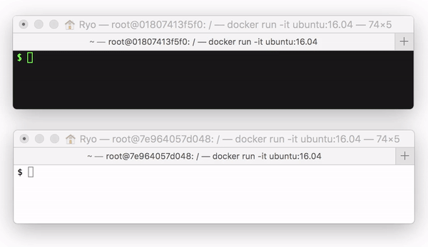
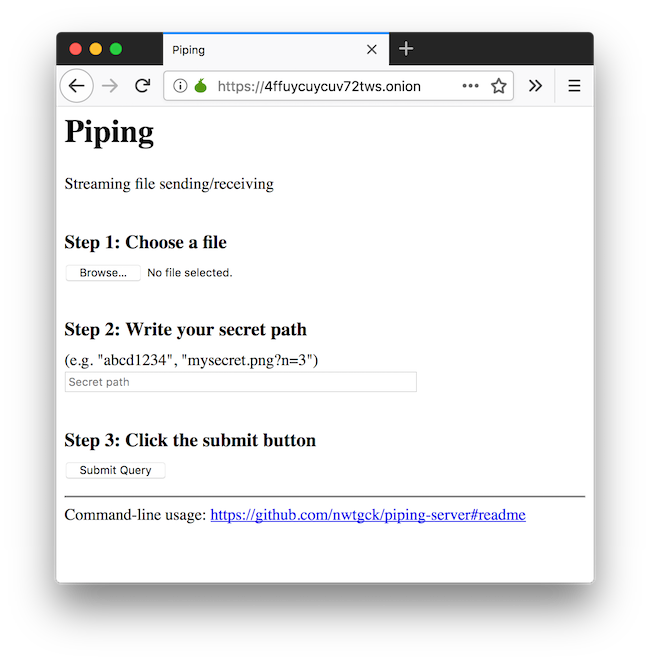

# piping-server-tor-docker-compose
[Piping server](https://github.com/nwtgck/piping-server) as [Tor](https://www.torproject.org/) Hidden Service



## Run server

Here is how to run Piping server as Tor Hidden Service.

```bash
# Go to this repo
cd <this repo>
# Create SSL certs and Initialize "tor_hidden_service" for docker volume sharing
./create_ssl_certs_and_init_hidden_service_dir.sh
# Run the server
docker-compose up
```

## Data Persistence

All data for persistence are under `./docker_volumes`.

## Check host name

You can check server's host name by

```bash
cat docker_volumes/tor_hidden_service/hostname
```

## Access to the server

You can send a file by like the following.

```bash
torsocks curl -T ./mytext.txt http://4ffuycuycuv72tws.onion/mypath1
```

Or you can access to the page like the following on Tor Browser.



(NOTE: You should replace hostname with yours)

## HTTPS access

`HTTPS` is also available in this docker-compose.

You should add `-k` or `--insecure` to `curl` option.

```bash
torsocks curl -k -T ./mytext.txt https://4ffuycuycuv72tws.onion/mypath1
```
